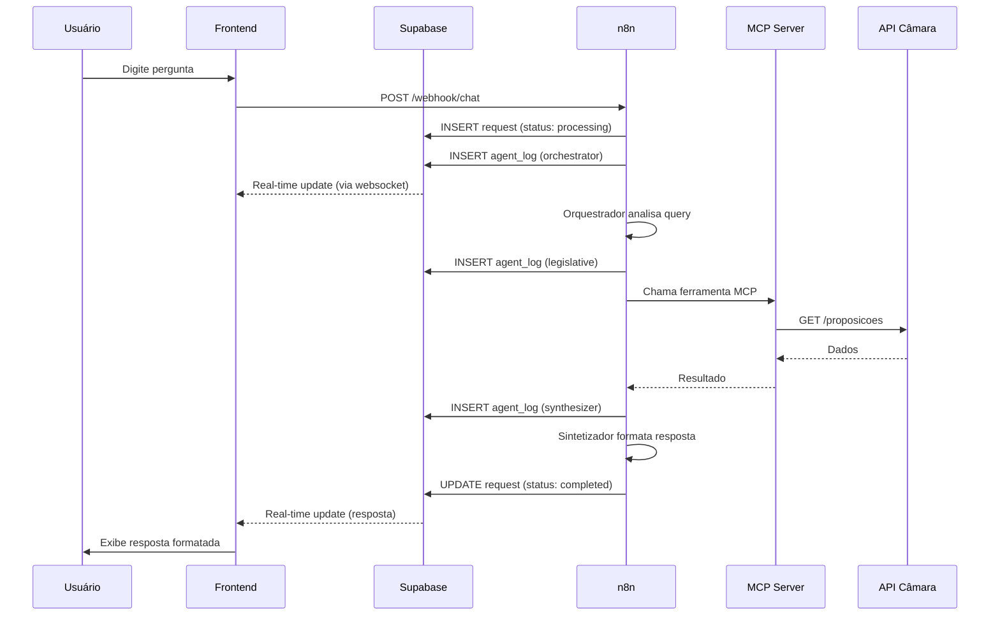

# Documentação de APIs - Agente Cidadão

Este documento descreve as integrações de APIs do **Agente Cidadão**, incluindo a comunicação com o backend n8n, Supabase e a API da Câmara dos Deputados.

## Sumário

- [Arquitetura de APIs](#arquitetura-de-apis)
- [API n8n Webhook](#api-n8n-webhook)
- [API Supabase](#api-supabase)
- [API Câmara dos Deputados (via MCP)](#api-câmara-dos-deputados-via-mcp)
- [Fluxo de Dados](#fluxo-de-dados)
- [Tratamento de Erros](#tratamento-de-erros)
- [Rate Limiting e Timeouts](#rate-limiting-e-timeouts)
- [Exemplos de Integração](#exemplos-de-integração)

---

## Arquitetura de APIs

O **Agente Cidadão** utiliza uma arquitetura multi-camada:

```
┌─────────────┐
│   Frontend  │ (React + TypeScript)
│  (Este App) │
└──────┬──────┘
       │
       ├─────────────────┐
       │                 │
       ▼                 ▼
┌──────────────┐  ┌──────────────┐
│ n8n Webhook  │  │   Supabase   │
│   (Backend)  │  │ (Real-time)  │
└──────┬───────┘  └──────────────┘
       │
       ▼
┌──────────────┐
│  MCP Server  │
│  (Câmara)    │
└──────┬───────┘
       │
       ▼
┌──────────────┐
│  API Câmara  │
│dos Deputados │
└──────────────┘
```

---

## API n8n Webhook

### Endpoint Base

```
POST https://n8n-agentecidadaoagentico-production.up.railway.app/webhook/chat
```

### Autenticação

Atualmente **não requer autenticação** (webhook público). Em produção, considere adicionar:
- API Key no header
- Token JWT
- IP whitelisting

### Requisição

#### Headers

```http
Content-Type: application/json
Accept: application/json
```

#### Body

```typescript
interface ChatRequest {
  user_query: string;           // Pergunta do usuário
  session_id?: string;          // ID da sessão (opcional, para memória conversacional)
  language?: 'pt-BR' | 'es-ES'; // Idioma preferido (default: pt-BR)
  context?: string;             // Contexto adicional (opcional)
}
```

#### Exemplo

```json
{
  "user_query": "Quais são os PLs sobre inteligência artificial em tramitação?",
  "session_id": "550e8400-e29b-41d4-a716-446655440000",
  "language": "pt-BR"
}
```

### Resposta

#### Sucesso (200 OK)

```typescript
interface ChatResponse {
  request_id: string;     // ID único da requisição
  answer: string;         // Resposta formatada em Markdown
  agents_used: string[];  // Agentes que foram acionados
  status: 'success';
  timestamp: string;      // ISO 8601
  session_id?: string;    // ID da sessão
}
```

#### Exemplo

```json
{
  "request_id": "req_abc123xyz",
  "answer": "## Proposições sobre Inteligência Artificial\n\n**PLs em tramitação:**\n\n1. **PL 2338/2023** - Regulamentação da IA no Brasil...",
  "agents_used": ["legislative"],
  "status": "success",
  "timestamp": "2026-01-10T14:30:00Z",
  "session_id": "550e8400-e29b-41d4-a716-446655440000"
}
```

#### Erro (4xx/5xx)

```typescript
interface ErrorResponse {
  error: string;          // Mensagem de erro
  code: string;           // Código do erro
  status: 'error';
  timestamp: string;
}
```

#### Exemplo

```json
{
  "error": "Timeout aguardando resposta dos agentes",
  "code": "TIMEOUT",
  "status": "error",
  "timestamp": "2026-01-10T14:30:00Z"
}
```

### Códigos de Status

- `200 OK` - Requisição processada com sucesso
- `400 Bad Request` - Parâmetros inválidos
- `408 Request Timeout` - Timeout (> 6 minutos)
- `429 Too Many Requests` - Rate limit excedido
- `500 Internal Server Error` - Erro interno no n8n ou agentes
- `503 Service Unavailable` - Serviço temporariamente indisponível

### Timeout

- **Timeout do Cliente**: 360000ms (6 minutos)
- **Timeout do n8n**: 360 segundos (configurado no workflow)

---

## API Supabase

### Configuração

```typescript
import { createClient } from '@supabase/supabase-js';

const supabase = createClient(
  import.meta.env.VITE_SUPABASE_URL,
  import.meta.env.VITE_SUPABASE_ANON_KEY
);
```

### Tabelas

#### 1. `requests`

Armazena todas as requisições de chat.

**Schema:**

```sql
CREATE TABLE requests (
  id UUID PRIMARY KEY DEFAULT gen_random_uuid(),
  user_query TEXT NOT NULL,
  answer TEXT,
  status TEXT DEFAULT 'processing',
  session_id UUID,
  agents_used TEXT[],
  error_message TEXT,
  created_at TIMESTAMP WITH TIME ZONE DEFAULT NOW(),
  updated_at TIMESTAMP WITH TIME ZONE DEFAULT NOW()
);
```

**Operações:**

```typescript
// Inserir nova requisição
const { data, error } = await supabase
  .from('requests')
  .insert({
    user_query: 'Pergunta do usuário',
    session_id: sessionId,
    status: 'processing'
  })
  .select()
  .single();

// Atualizar status
await supabase
  .from('requests')
  .update({
    answer: 'Resposta...',
    status: 'completed'
  })
  .eq('id', requestId);

// Buscar histórico
const { data } = await supabase
  .from('requests')
  .select('*')
  .eq('session_id', sessionId)
  .order('created_at', { ascending: false })
  .limit(10);
```

#### 2. `agent_logs`

Registra logs de atividade dos agentes em tempo real.

**Schema:**

```sql
CREATE TABLE agent_logs (
  id UUID PRIMARY KEY DEFAULT gen_random_uuid(),
  request_id UUID REFERENCES requests(id),
  agent_name TEXT NOT NULL,
  status TEXT NOT NULL,
  message TEXT,
  created_at TIMESTAMP WITH TIME ZONE DEFAULT NOW()
);
```

**Operações:**

```typescript
// Inserir log
await supabase
  .from('agent_logs')
  .insert({
    request_id: requestId,
    agent_name: 'legislative',
    status: 'processing',
    message: 'Consultando proposições...'
  });

// Subscribe para updates em tempo real
const channel = supabase
  .channel('agent-logs')
  .on(
    'postgres_changes',
    {
      event: 'INSERT',
      schema: 'public',
      table: 'agent_logs',
      filter: `request_id=eq.${requestId}`
    },
    (payload) => {
      console.log('Novo log:', payload.new);
    }
  )
  .subscribe();
```

#### 3. `sessions` (se memória conversacional ativada)

**Schema:**

```sql
CREATE TABLE sessions (
  id UUID PRIMARY KEY DEFAULT gen_random_uuid(),
  user_id UUID,
  context JSONB DEFAULT '{}',
  entities JSONB DEFAULT '[]',
  created_at TIMESTAMP WITH TIME ZONE DEFAULT NOW(),
  updated_at TIMESTAMP WITH TIME ZONE DEFAULT NOW(),
  last_activity TIMESTAMP WITH TIME ZONE DEFAULT NOW()
);
```

### Real-time Subscriptions

```typescript
// Monitora mudanças na tabela requests
const subscription = supabase
  .channel('request-updates')
  .on(
    'postgres_changes',
    {
      event: 'UPDATE',
      schema: 'public',
      table: 'requests',
      filter: `id=eq.${requestId}`
    },
    (payload) => {
      if (payload.new.status === 'completed') {
        console.log('Resposta recebida:', payload.new.answer);
      }
    }
  )
  .subscribe();

// Cleanup
subscription.unsubscribe();
```

---

## API Câmara dos Deputados (via MCP)

O backend n8n acessa a API da Câmara através do **MCP Server**, que fornece ferramentas estruturadas para os agentes.

### Endpoint MCP

```
https://agentecidadaomcp-production.up.railway.app/mcp
```

### Ferramentas Disponíveis

#### Agente Legislativo (23 ferramentas)

1. **Proposições**
   - `buscar_proposicoes` - Busca por PLs, PECs, MPVs
   - `detalhes_proposicao` - Detalhes de uma proposição específica
   - `tramitacoes_proposicao` - Histórico de tramitação
   - `autores_proposicao` - Autores de uma proposição

2. **Votações**
   - `votacoes_proposicao` - Votações de uma proposição
   - `orientacoes_votacao` - Orientações de partidos/blocos
   - `votos_deputados` - Como cada deputado votou

3. **Tramitação**
   - `situacao_proposicao` - Situação atual
   - `relacionadas_proposicao` - Proposições relacionadas

#### Agente Político (17 ferramentas)

1. **Deputados**
   - `listar_deputados` - Lista deputados por filtros
   - `detalhes_deputado` - Perfil completo
   - `despesas_deputado` - Gastos parlamentares
   - `discursos_deputado` - Discursos em plenário

2. **Partidos**
   - `listar_partidos` - Lista todos os partidos
   - `membros_partido` - Deputados de um partido

3. **Órgãos**
   - `listar_orgaos` - Comissões, frentes, etc.
   - `membros_orgao` - Membros de uma comissão

#### Agente Fiscal (7 ferramentas)

1. **Despesas**
   - `despesas_deputado` - Gastos por deputado
   - `despesas_tipo` - Gastos por categoria
   - `fornecedores_deputado` - Fornecedores contratados
   - `analise_gastos` - Análise agregada de gastos

### Estrutura de Dados

#### Proposição

```typescript
interface Proposicao {
  id: number;
  tipo: string;              // PL, PEC, MPV, etc.
  numero: number;
  ano: number;
  ementa: string;
  siglaTipo: string;
  statusProposicao: {
    siglaOrgao: string;
    regime: string;
    descricaoTramitacao: string;
    descricaoSituacao: string;
  };
  urlInteiroTeor: string;
}
```

#### Deputado

```typescript
interface Deputado {
  id: number;
  nome: string;
  siglaPartido: string;
  siglaUf: string;
  urlFoto: string;
  email: string;
  urlWebsite: string;
  nomeCivil: string;
  cpf: string;
  escolaridade: string;
  dataNascimento: string;
}
```

#### Despesa

```typescript
interface Despesa {
  ano: number;
  mes: number;
  tipoDespesa: string;
  codDocumento: number;
  dataDocumento: string;
  numDocumento: string;
  valorDocumento: number;
  valorGlosa: number;
  valorLiquido: number;
  nomeFornecedor: string;
  cnpjCpfFornecedor: string;
}
```

---

## Fluxo de Dados

### Fluxo Completo de uma Consulta



---

## Tratamento de Erros

### Estratégias de Retry

```typescript
async function fetchWithRetry(
  url: string,
  options: RequestInit,
  maxRetries = 3
): Promise<Response> {
  for (let i = 0; i < maxRetries; i++) {
    try {
      const response = await fetch(url, options);
      if (response.ok) return response;

      // Não retry em erros 4xx (exceto 429)
      if (response.status >= 400 && response.status < 500 && response.status !== 429) {
        throw new Error(`HTTP ${response.status}: ${response.statusText}`);
      }

      // Exponential backoff
      if (i < maxRetries - 1) {
        await new Promise(resolve => setTimeout(resolve, 1000 * Math.pow(2, i)));
      }
    } catch (error) {
      if (i === maxRetries - 1) throw error;
    }
  }
  throw new Error('Max retries reached');
}
```

### Mensagens de Erro

```typescript
const ERROR_MESSAGES = {
  NETWORK_ERROR: 'Erro de conexão. Verifique sua internet.',
  TIMEOUT: 'A consulta demorou muito. Tente novamente.',
  INVALID_QUERY: 'Por favor, reformule sua pergunta.',
  SERVER_ERROR: 'Erro no servidor. Tente novamente em alguns instantes.',
  RATE_LIMIT: 'Muitas requisições. Aguarde um momento.'
};
```

---

## Rate Limiting e Timeouts

### Limites da API Câmara

- **Rate Limit**: ~300 requisições/hora por IP
- **Timeout**: 30 segundos por requisição

### Limites do n8n

- **Timeout do Workflow**: 360 segundos (6 minutos)
- **Execuções Simultâneas**: Depende do plano Railway

### Implementação no Frontend

```typescript
// Debounce para evitar múltiplas requisições
const debouncedSend = debounce((query: string) => {
  sendMessage(query);
}, 500);

// Timeout configurável
const TIMEOUT = parseInt(import.meta.env.VITE_REQUEST_TIMEOUT) || 360000;

const controller = new AbortController();
const timeoutId = setTimeout(() => controller.abort(), TIMEOUT);

try {
  const response = await fetch(webhookUrl, {
    signal: controller.signal,
    // ... outras opções
  });
} catch (error) {
  if (error.name === 'AbortError') {
    console.error('Request timeout');
  }
} finally {
  clearTimeout(timeoutId);
}
```

---

## Exemplos de Integração

### Exemplo 1: Enviar Mensagem

```typescript
import { sendMessageToN8N } from './lib/api';

async function handleUserMessage(message: string) {
  try {
    const response = await sendMessageToN8N({
      user_query: message,
      session_id: currentSessionId,
      language: currentLanguage
    });

    console.log('Resposta:', response.answer);
    console.log('Agentes usados:', response.agents_used);
  } catch (error) {
    console.error('Erro:', error);
  }
}
```

### Exemplo 2: Monitorar Logs em Tempo Real

```typescript
import { supabase } from './lib/supabase';

function subscribeToAgentLogs(requestId: string, onLog: (log: AgentLog) => void) {
  const channel = supabase
    .channel(`logs-${requestId}`)
    .on(
      'postgres_changes',
      {
        event: 'INSERT',
        schema: 'public',
        table: 'agent_logs',
        filter: `request_id=eq.${requestId}`
      },
      (payload) => {
        onLog(payload.new as AgentLog);
      }
    )
    .subscribe();

  return () => {
    channel.unsubscribe();
  };
}

// Uso
const unsubscribe = subscribeToAgentLogs(requestId, (log) => {
  console.log(`${log.agent_name}: ${log.message}`);
});
```

### Exemplo 3: Buscar Histórico

```typescript
async function fetchChatHistory(sessionId: string, limit = 10) {
  const { data, error } = await supabase
    .from('requests')
    .select('id, user_query, answer, created_at, agents_used')
    .eq('session_id', sessionId)
    .eq('status', 'completed')
    .order('created_at', { ascending: false })
    .limit(limit);

  if (error) throw error;
  return data;
}
```

---

## Referências Externas

- [API Dados Abertos Câmara dos Deputados](https://dadosabertos.camara.leg.br/swagger/api.html)
- [Supabase JavaScript Client](https://supabase.com/docs/reference/javascript/introduction)
- [n8n Webhook Documentation](https://docs.n8n.io/integrations/builtin/core-nodes/n8n-nodes-base.webhook/)

---

Esta documentação é mantida pela equipe do **Agente Cidadão**. Para dúvidas ou sugestões, abra uma issue no repositório.
