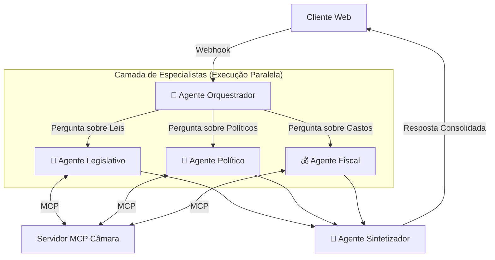
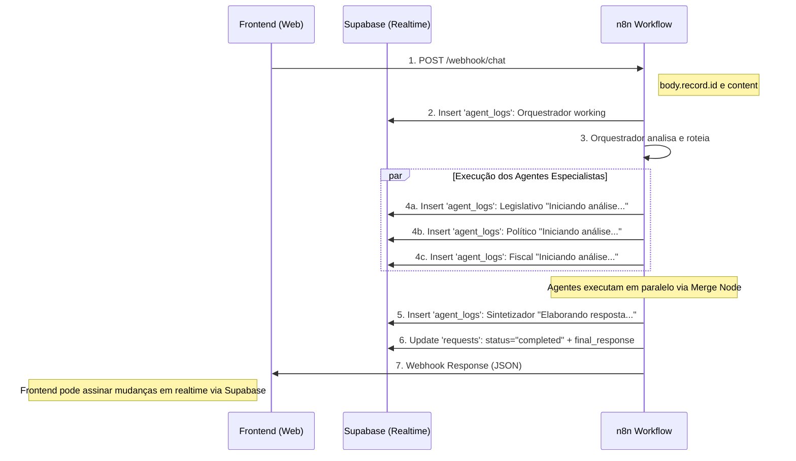

# Arquitetura Multi-Agentes: "Agente Cidadão"

Este documento descreve a arquitetura real implementada do sistema **Agente Cidadão**, um sistema multi-agentes orquestrado pelo n8n, focado em **paralelismo** (para velocidade) e **especialização** (para qualidade de respostas sobre dados legislativos da Câmara dos Deputados).

## 🏗️ Visão Geral da Arquitetura

O sistema utiliza uma arquitetura de múltiplos agentes especializados coordenados por um **Orquestrador** que delega tarefas para **Especialistas** que podem trabalhar simultaneamente. Um **Sintetizador** consolida as respostas no final.



## 🤖 Papéis dos Agentes (Implementação Real)

### 1. Agente Orquestrador

- **Função:** Analisar a pergunta do usuário e decidir quais agentes especialistas devem ser acionados.
- **Modelo de IA:** OpenRouter GPT-4o-mini
- **Prompt do Sistema:** Analisa a pergunta e retorna JSON com array de agentes necessários
- **Agentes disponíveis:** `legislativo`, `politico`, `fiscal`
- **Formato de saída:** `{"agentes": ["legislativo", "fiscal"]}`
- **Roteamento:** Utiliza um Switch Node (Router) que direciona para os agentes especializados baseado na resposta

### 2. Agentes Especialistas

#### 📜 Agente Legislativo

- **Foco:** Proposições legislativas, tramitações, votações e processo legislativo
- **Modelo de IA:** OpenRouter Claude 3.5 Sonnet (anthropic/claude-3.5-sonnet)
- **Ferramentas MCP disponíveis:**
  - Proposições: `buscar_proposicoes`, `detalhar_proposicao`, `autores_proposicao`, `tramitacoes_proposicao`, `votacoes_proposicao`, `relacionadas_proposicao`, `temas_proposicao`
  - Votações: `buscar_votacoes`, `votos_votacao`, `detalhar_votacao`, `orientacoes_votacao`, `ultimas_votacoes`
  - Análises: `comparativo_votacoes_bancadas`, `timeline_tramitacao`, `ranking_proposicoes_autor`
  - Referência: `tipos_proposicao`, `diagnosticar_consulta`, `sugerir_ferramentas`
  - Auxiliares: `buscar_deputados`, `buscar_orgaos`
- **Escopo:** Responde sobre PLs, PECs, MPVs, tramitações, votações, autoria e temas legislativos
- **Redirecionamento:** Encaminha perguntas sobre perfil de deputado para Agente Político e gastos para Agente Fiscal
- **Timeout:** 60 segundos para operações MCP

#### 👔 Agente Político

- **Foco:** Perfil e atuação parlamentar dos deputados
- **Modelo de IA:** OpenRouter Claude 3.5 Sonnet (anthropic/claude-3.5-sonnet)
- **Ferramentas MCP disponíveis:**
  - Perfil: `buscar_deputados`, `detalhar_deputado`, `profissoes_deputado`, `ocupacoes_deputado`
  - Atuação: `discursos_deputado`, `orgaos_deputado`, `frentes_deputado`, `eventos_deputado`, `analise_presenca_deputado`
  - Estrutura: `buscar_partidos`, `detalhar_partido`, `membros_partido`, `lideres_partido`, `buscar_orgaos`, `membros_orgao`, `mesa_legislatura`, `buscar_frentes`, `membros_frente`
  - Referência: `ufs`, `tipos_orgao`
- **Escopo:** Identidade, trajetória, participação e posicionamento dos deputados
- **Redirecionamento:** Encaminha perguntas sobre gastos para Agente Fiscal e sobre proposições para Agente Legislativo
- **Modo de erro:** `continueRegularOutput` (continua mesmo em caso de erro)

#### 💰 Agente Fiscal

- **Foco:** Despesas parlamentares (CEAP - Cota para Exercício da Atividade Parlamentar)
- **Modelo de IA:** OpenRouter Claude 3 Haiku (anthropic/claude-3-haiku)
- **Ferramentas MCP disponíveis:**
  - Despesas: `buscar_deputados`, `despesas_deputado`, `detalhar_deputado`, `analise_despesas_partido`
  - Complementares: `buscar_proposicoes`, `analise_presenca_deputado`, `discursos_deputado`
- **Escopo:** Análise de gastos, cotas parlamentares, despesas e auditoria fiscal
- **Redirecionamento:** Correlaciona gastos com atividade legislativa quando relevante
- **Máximo de iterações:** 20

### 3. Agente Sintetizador (Consolidador)

- **Função:** Consolidar as análises dos especialistas em uma resposta final coesa
- **Modelo de IA:** OpenRouter Gemini 2.5 Flash (google/gemini-2.5-flash)
- **Entrada:** Pergunta original + JSON com todas as análises recebidas dos agentes
- **Ferramentas MCP:** Acesso completo ao MCP Câmara para complementar informações se necessário
- **Formato de saída:** Markdown
- **Regras:**
  - Apresentar listas completas (não resumir)
  - Ser direto e fluido em explicações textuais
  - Avisar claramente se não houver dados
  - Pode buscar informações adicionais via MCP se necessário para completar a resposta

---

## 🔧 Implementação Técnica no n8n

### Fluxo de Execução

1. **Webhook de Entrada**
   - Endpoint: `/webhook/chat` (método POST)
   - Recebe a pergunta do usuário via `body.record.content`
   - ID da requisição: `body.record.id`

2. **Logging e Rastreamento**
   - Tabela Supabase `agent_logs` registra cada etapa
   - Tabela Supabase `requests` armazena status e resposta final
   - Campos registrados: `request_id`, `agent_name`, `message`, `status`

3. **Orquestração**
   - Log inicial: "Analisando sua solicitação..."
   - Orquestrador analisa e retorna JSON com agentes necessários
   - JavaScript Code Node extrai o primeiro agente do array
   - Switch Node (Router) roteia para o agente apropriado

4. **Execução dos Agentes Especializados**
   - Cada agente recebe: `user_query` (pergunta original)
   - Logs individuais: "Iniciando análise..." para cada agente
   - Agentes podem executar em paralelo (via Merge Node com 3 entradas)
   - Cada agente acessa seu subset específico de ferramentas MCP

5. **Consolidação**
   - Merge Node aguarda todas as respostas dos agentes acionados
   - Log: "Elaborando a resposta final..."
   - Sintetizador recebe todas as análises via JSON
   - Pode fazer chamadas MCP adicionais se necessário

6. **Resposta Final**
   - Update no Supabase: status `completed` + `final_response`
   - Webhook Response retorna JSON com a resposta consolidada

### Infraestrutura

**Servidor MCP:**

- URL: `https://agentecidadaomcp-production.up.railway.app/mcp`
- Expõe todas as ferramentas da API da Câmara dos Deputados
- Timeout configurável (60s para Agente Legislativo)

**Modelos de IA (OpenRouter):**

- Orquestrador: GPT-4o-mini (rápido e econômico para classificação)
- Legislativo: Claude 3.5 Sonnet (raciocínio complexo)
- Político: Claude 3.5 Sonnet (análise detalhada)
- Fiscal: Claude 3 Haiku (custo-benefício para análise numérica)
- Sintetizador: Gemini 2.5 Flash (síntese rápida e eficiente)

**Banco de Dados (Supabase):**

- Credenciais: ID `5y5XCrIlACcF46pQ`
- Tabelas: `requests`, `agent_logs`
- Permite rastreamento completo do workflow

### Tratamento de Erros

- Agente Político: configurado com `continueRegularOutput` para não bloquear o workflow
- Timeout de 60s nas operações MCP do Agente Legislativo
- Máximo de 20 iterações no Agente Fiscal para evitar loops infinitos

---

## 🌟 Arquitetura Transparente (Realtime) - Implementada

O sistema já possui a infraestrutura para **transparência em tempo real** através do Supabase. O workflow n8n registra cada etapa do processo, permitindo que o frontend acompanhe o progresso.

### Implementação Atual

O sistema utiliza o Supabase como **barramento de eventos** para comunicação em tempo real:

**Tabela `requests`:**

- Armazena cada pergunta do usuário
- Campos: `id`, `content`, `status`, `final_response`
- Status rastreados: enviado → processando → completed
- Atualizada ao final com a resposta consolidada

**Tabela `agent_logs`:**

- Registra cada ação dos agentes em tempo real
- Campos: `request_id`, `agent_name`, `message`, `status`, `timestamp`
- Exemplos de logs:
  - Orquestrador: "Analisando sua solicitação..." (status: working)
  - Legislativo: "Iniciando análise..." (status: info)
  - Político: "Iniciando análise..." (status: info)
  - Fiscal: "Iniciando análise..." (status: info)
  - Sintetizador: "Elaborando a resposta final..." (status: working)

### Fluxo Realtime Implementado



### Experiência do Usuário (UX) Proposta

O frontend pode aproveitar a infraestrutura de logging para criar uma experiência transparente:

**Interface com Cards Dinâmicos:**

1. **Card do Orquestrador:**
   - Mostra "Analisando sua solicitação..."
   - Indica quais agentes serão acionados

2. **Cards dos Agentes Especialistas:**
   - 📜 **Legislativo:** "Iniciando análise..." → "Buscando proposições..." → "Análise concluída"
   - 👔 **Político:** "Iniciando análise..." → "Consultando perfil..." → "Dados coletados"
   - 💰 **Fiscal:** "Iniciando análise..." → "Verificando despesas..." → "Análise completa"

3. **Card do Sintetizador:**
   - "Elaborando a resposta final..."
   - "Consolidando informações..."

4. **Resposta Final:**
   - Texto em Markdown consolidado
   - Referências às fontes (Câmara dos Deputados)

### Vantagens da Arquitetura Realtime

1. **Percepção de Velocidade:** Usuário vê atividade imediata, reduzindo ansiedade da espera
2. **Confiança:** Transparência sobre os passos executados aumenta credibilidade
3. **Engajamento:** Visualmente atraente e educativo sobre o funcionamento do sistema
4. **Debugging:** Logs facilitam identificação de problemas

### Integração Frontend com Supabase

O frontend pode usar o **Supabase Realtime** para assinar mudanças:

```javascript
// Exemplo de assinatura aos logs do agente
const supabase = createClient(SUPABASE_URL, SUPABASE_KEY)

// Assinar mudanças na tabela agent_logs para um request específico
const subscription = supabase
  .channel('agent-logs')
  .on('postgres_changes', {
    event: 'INSERT',
    schema: 'public',
    table: 'agent_logs',
    filter: `request_id=eq.${requestId}`
  }, (payload) => {
    // Atualizar UI com novo log
    updateAgentCard(payload.new.agent_name, payload.new.message)
  })
  .subscribe()

// Assinar mudanças na tabela requests para capturar resposta final
const requestSubscription = supabase
  .channel('request-updates')
  .on('postgres_changes', {
    event: 'UPDATE',
    schema: 'public',
    table: 'requests',
    filter: `id=eq.${requestId}`
  }, (payload) => {
    if (payload.new.status === 'completed') {
      displayFinalResponse(payload.new.final_response)
    }
  })
  .subscribe()
```

---

## 📊 Visão Geral das Ferramentas MCP por Agente

### Agente Legislativo (23 ferramentas)

Foco em proposições e votações da Câmara dos Deputados.

### Agente Político (17 ferramentas)

Foco em perfil, atuação e estrutura parlamentar.

### Agente Fiscal (7 ferramentas)

Foco em despesas e auditoria da cota parlamentar.

### Sintetizador (Todas as ferramentas)

Acesso completo para complementar informações se necessário.

---

## 🚀 Endpoint do Sistema

**URL do Workflow n8n:**

```http
POST https://n8n-agentecidadaoagentico-production.up.railway.app/webhook/chat
```

**Payload esperado:**

```json
{
  "body": {
    "record": {
      "id": "uuid-da-requisicao",
      "content": "Pergunta do usuário em linguagem natural"
    }
  }
}
```

**Resposta:**

```json
{
  "output": "Resposta consolidada em Markdown..."
}
```

---

## 📝 Notas de Implementação

1. **Paralelismo:** Os três agentes especialistas podem executar simultaneamente através do Merge Node
2. **Logging Completo:** Cada etapa é registrada no Supabase para rastreabilidade
3. **Modelos Otimizados:** Cada agente usa o modelo de IA mais adequado ao seu propósito
4. **Ferramentas Específicas:** Cada agente tem acesso apenas às ferramentas MCP relevantes ao seu domínio
5. **Tratamento de Erros:** Sistema configurado para continuar operando mesmo se um agente falhar
6. **Timeout Configurável:** Operações MCP têm timeout para evitar travamentos

---

## 🔮 Próximas Evoluções

1. **Frontend Realtime:** Implementar interface que consome os logs em tempo real
2. **Métricas de Performance:** Rastrear tempo de execução de cada agente
3. **Cache de Respostas:** Armazenar respostas frequentes para otimização
4. **Novos Agentes:** Expandir para outros órgãos públicos (Senado, TCU, etc.)
5. **Análises Preditivas:** Usar histórico para prever tendências legislativas
