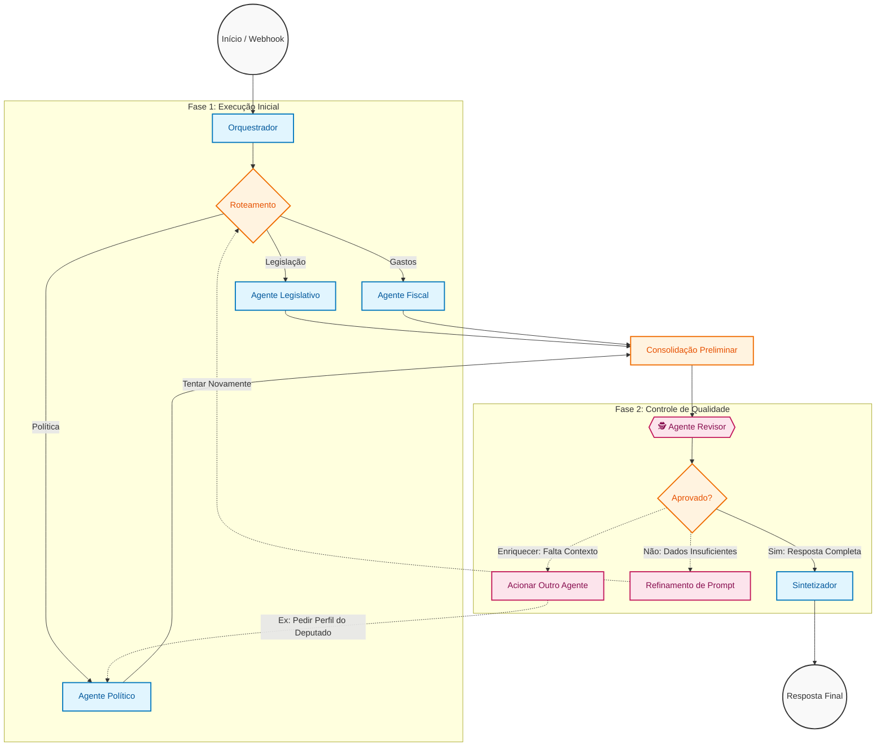

# Proposta de Arquitetura: Ciclo de Revisão e Enriquecimento

Esta proposta introduz um **Agente Revisor** no fluxo de trabalho para garantir a qualidade, consistência e completude das respostas antes de serem entregues ao usuário.

## Diagrama do Fluxo

## Detalhes dos Componentes

### 1. Agente Revisor (O "Editor-Chefe")
*   **Função:** Analisar as respostas dos agentes especialistas.
*   **Critérios:**
    *   A resposta atende à pergunta do usuário?
    *   Há contradições entre os agentes?
    *   Faltam dados essenciais?
*   **Ações:** Aprovar, Solicitar Refinamento ou Solicitar Enriquecimento.

### 2. Loop de Refinamento
*   Permite que o sistema tente novamente caso a busca inicial falhe (ex: erro de digitação, parâmetros incorretos).

### 3. Enriquecimento (Cross-Agent)
*   Permite que o Revisor acione agentes que não foram chamados inicialmente para adicionar contexto valioso (ex: adicionar perfil político a uma consulta fiscal).
